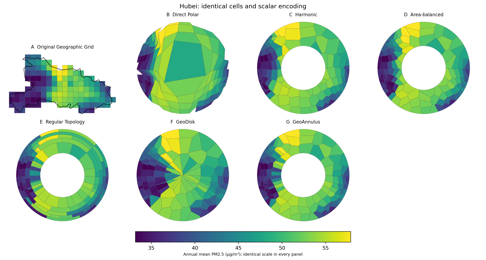
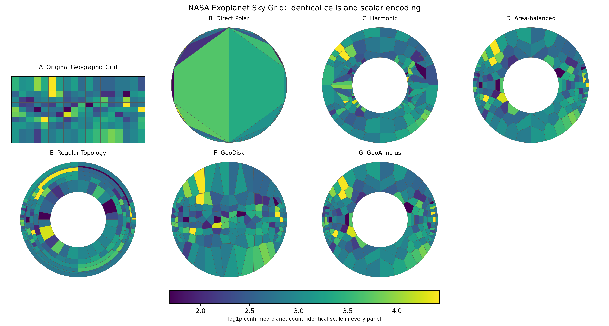
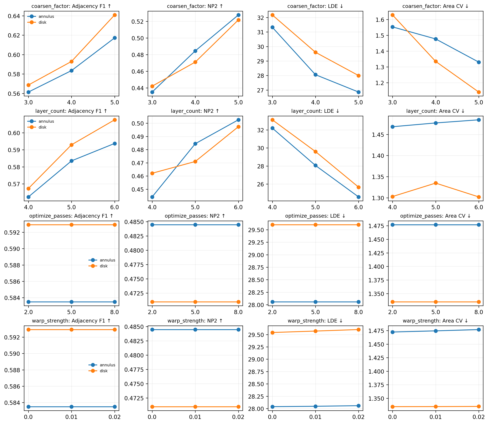
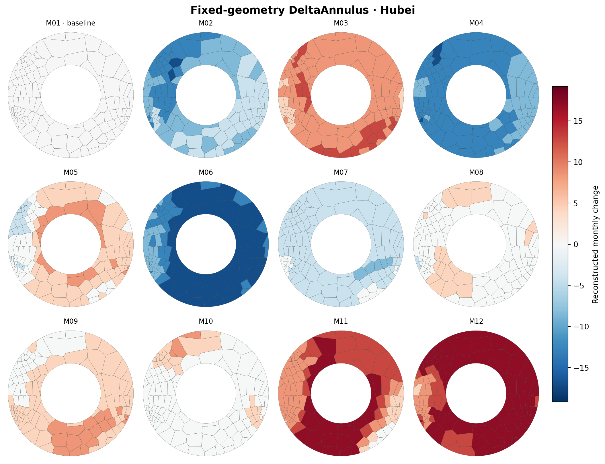

# GeoDisk Lab 项目代码、实验、图片与表格全景说明

> 本文档以当前仓库原版本（`6856904`）的代码、配置和已生成结果为准。目的不是重新定义项目，而是回答四个问题：项目究竟研究什么、代码怎样运行、每个目录和实验阶段负责什么、论文图片与表格应该如何解释。

## 1. 一句话理解整个项目

GeoDisk Lab 将具有固定单元和参考邻接关系的地理或科学空间分区，转换为紧凑的圆盘（Disk）或圆环（Annulus）Power Diagram；它首先保证最终显示多边形合法、无明显重叠和空洞，再尽量保存原始邻接、局部邻域、方向和中心—边缘顺序，并在同一套固定几何上表达月份变化，最后通过 Python 实验、统计表、静态论文图、FastAPI 和 React + D3 单页系统形成一条可复现链路。

项目最合适的定位是：

- **方法层**：受参考拓扑监督的圆盘/圆环 Power 分区生成与最终多边形邻接优化。
- **评价层**：几何合法性、拓扑保持、方向/径向保持、边界/内部误差、稳健性和统计推断。
- **时间层**：固定单元身份和固定几何上的 DeltaAnnulus 月变化编码。
- **系统层**：地图、Disk/Annulus、年度状态、时间轮廓、局部邻接和迁移快照的 D3 联动分析。

当前能支持的核心结论是：最终方法在保持几何合法的基线中取得了更稳定的拓扑保持结果，但没有证明对所有方法全面最优；尤其 Direct Polar 的部分邻接分数更高，但它会产生无效、重叠或未覆盖的多边形。

## 2. 科学问题与实验判定顺序

### 2.1 科学问题

给定一组原始空间单元 (V)、参考邻接边 (E_r)、原始位置与标量值，如何构造一个圆盘或圆环分区，使其同时满足：

1. 每个单元仍有唯一且稳定的 `cell_id`；
2. 最终多边形组成合法分区；
3. 显示邻接 (E_d) 尽量接近参考邻接 (E_r)；
4. 原始局部方向和中心—边缘顺序尽量保留；
5. 同一几何可以跨月份复用，使变化比较不受重新布局干扰。

### 2.2 为什么评价必须分层

项目不是简单地寻找一个最高综合分，而是按以下顺序判断：

1. **几何准入**：`invalid_polygon_count = 0`，且 overlap/gap 不超过 `1e-7`。
2. **主要拓扑结果**：比较最终多边形重新提取的 Adjacency F1。
3. **结构解释**：使用 NP@2、共享边界加权 F1、边界/内部 Node F1 和失败类型解释全局结果。
4. **空间关系代价**：分别报告方向误差、方位误差、径向 Spearman 和面积 CV。
5. **稳健性**：检查 4/8 邻域、裁剪策略、接触容差、参数、随机种子和消融。
6. **时间数值忠实度**：比较直接差值编码与“先编码值再作差”。
7. **感知收益**：必须由真人实验验证，不能从算法指标直接推出。

这个顺序意味着：一个方法即使邻接 F1 很高，只要产生非法多边形，也不能直接作为“合法圆形分区更优”的证据。

## 3. 从原始数据到界面的总流程

```text
原始 CEG NetCDF / 外部数据 / 合成形状
                │
                ▼
        E0 数据审计与变量确认
                │
                ▼
 E1/E10 生成统一 RegionReference
 cells.csv + 原始 GeoJSON + 邻接 + 邻域 + 方向
                │
                ▼
      E2/E3/E11/E13 生成布局
 Direct Polar / Harmonic / Area-balanced /
 Regular Topology / GeoDisk / GeoAnnulus
                │
                ▼
 E16 拓扑嵌入修订 → E19 最终 Power 邻接细化
 多起点 + 真实最终多边形评分 + 拓扑力迭代 + 几何硬门槛
                │
        ┌───────┴────────┐
        ▼                ▼
 E4/E12/E17–E28      E5/E6/E21
 空间、统计、稳健性    固定几何时间编码与用户实验材料
        │                │
        └───────┬────────┘
                ▼
  CSV / GeoJSON / PNG / JSON manifest
                │
        ┌───────┴────────┐
        ▼                ▼
   FastAPI 本地接口    导出的静态 JSON 快照
        └───────┬────────┘
                ▼
        React 状态协调 + D3 绘制
```

## 4. 根目录结构

```text
geodisk-lab-system/
├── README.md                     # 项目入口与运行说明
├── backend/                      # 科研算法、实验、数据和论文产物
├── frontend/                     # 单页 React + D3 可视分析系统
├── docs/                         # 跨前后端的中文说明和架构文档
└── scripts/                      # 安装、启动、验证和前端快照导出入口
```

### 4.1 根目录脚本

| 文件 | 作用 |
|---|---|
| `scripts/setup_system.sh` | 创建 `backend/.venv`、安装 Python 依赖并执行前端 `npm install`。 |
| `scripts/start_system.sh` | 同时启动 FastAPI `127.0.0.1:8000` 和前端 `localhost:3000`，退出时清理两个进程。 |
| `scripts/verify_system.sh` | 执行后端单元/集成测试、前端 lint 和生产构建；当前恢复版本是 25 项测试。 |
| `scripts/export_workbench_snapshots.py` | 调用与 API 相同的数据组装函数，将 11 个数据集 × 2 个视图导出为 22 个前端静态 JSON，并导出实验审计证据。 |

## 5. `backend/` 文件夹构成

```text
backend/
├── config/                       # 数据、几何、实验和论文主张的冻结配置
├── data/
│   ├── boundaries/               # 8 个省域边界
│   ├── external/                 # NOAA、Natural Earth、NASA 外部数据
│   ├── processed/                # 统一格式的参考数据
│   └── raw/README.md             # 主原始数据位置说明；大文件不直接放仓库
├── src/geodisk_paper/            # 可复用 Python 包
├── experiments/                  # E0–E30 实验脚本
├── scripts/                      # 后端分阶段和正式流水线入口
├── results/                      # 完整、可追踪的运行结果
├── paper/                        # 适合论文引用的图、表和审计报告
├── tests/                        # 科学不变量与 API 集成测试
├── user_study/                   # 预注册草案、任务和刺激材料
└── requirements*.txt / pyproject.toml
```

### 5.1 `backend/config/`

| 配置 | 主要内容 |
|---|---|
| `datasets.yaml` | 主 CEG 数据相对路径、文件模式、年份、外部数据 URL 和角色。主数据名 `CEG-PM2.5-2000` 是项目内部名。 |
| `geometry.yaml` | Disk/Annulus 半径、层数、优化轮数、Power 迭代、warp、最终 Power 多起点和目标权重。 |
| `experiment.yaml` | 固定随机种子 `20260827`、8 个省域、敏感性取值、时间分箱和正式重复次数。 |
| `formal_hypotheses.yaml` | H1–H3、稳健性问题、统计单位、Holm 校正和论文表述边界。该计划是探索后冻结，不是事前预注册。 |
| `tvcg_submission.yaml` | 面向 TVCG 的目标、研究问题、贡献和不能越界的主张。 |

### 5.2 `backend/data/processed/` 的统一参考格式

无论输入是省域网格、非洲国家、不规则外部数据还是天球网格，最终都转为同一套六文件结构：

| 文件 | 含义 |
|---|---|
| `cells.csv` | 一行一个单元；保存 `cell_id`、原位置、`theta`、`rho`、标量和月份值。 |
| `original_geometry.geojson` | 原始空间多边形，是 Map 视图和参考共享边界的来源。 |
| `original_adjacency.csv` | 参考边集 (E_r)。规则 CEG 默认使用 4-neighbor。 |
| `neighborhoods.json` | 每个单元的 1/2/3-hop 邻域。 |
| `original_local_directions.csv` | 每条有向邻接在原始空间中的角度。 |
| `reference_metadata.json` | 单元数、边数、参考中心、粗化因子和源网格分辨率。 |

CEG 的原始 0.1° 日尺度网格先按 `coarsen_factor=4` 合并为宏单元。一个宏单元只有在省域内有效细网格占比达到 `min_valid_fraction=0.25` 时才保留。之后对 366 天求年均值，并对每个月求均值。

`cell_id` 形如 `CEG2000_f4_r0027_c0088`，由年份、粗化因子、块行和块列组成；它是原始地图、Disk、Annulus、月份数据和前端选择之间的连接键。

### 5.3 `backend/src/geodisk_paper/`

| 模块 | 作用 |
|---|---|
| `config.py` | 读取 YAML、解析项目路径、固定随机种子、创建输出目录。 |
| `data/adapters.py` | 日尺度 NetCDF 适配器；检查变量和经纬度，不静默猜 PM₂.₅ 变量。 |
| `data/audit.py` | 生成 366 文件清单、SHA-256、日期、变量和缺失值报告。 |
| `data/regions.py` | 省域裁切、宏单元聚合、参考邻接、k-hop 邻域、方向和 `RegionReference`。 |
| `data/external_datasets.py` | Natural Earth、NCEP、NASA 天球网格和六种合成形状的统一适配。 |
| `topology/embedding.py` | 径向分层槽位、初始指派和槽位交换优化。 |
| `geometry/mappings.py` | 三个基线、GeoDisk/GeoAnnulus 初版和种子位置生成。 |
| `geometry/power.py` | 半平面裁剪实现 Power cell、权重迭代面积平衡、圆盘/圆环域和可选 warp。 |
| `topology/power_refinement.py` | 最终方法：多起点、最终多边形评分、lost/new 边力优化和几何准入。 |
| `metrics/geometry.py` | 从最终多边形提取邻接/共享边界，计算 invalid、overlap、gap、Area CV。 |
| `metrics/spatial.py` | F1、NP@k、加权邻接、方向、方位、径向和节点级误差。 |
| `temporal/encoding.py` | 固定最终 Annulus 上的值分箱与直接差值分箱。 |
| `visualization/figures.py` | Matplotlib 论文对比图与敏感性图。 |
| `api.py` | 只读结果 API、工作台数据拼装和白名单实验运行。 |

## 6. 方法代码的详细思路

### 6.1 参考空间的建立

`prepare_region_references()` 完成以下步骤：

1. 读取第一天数据并确认有效网格；
2. 判断网格中心是否位于省域内；
3. 将细网格按行列合并为宏单元；
4. 对 366 天逐单元聚合，拒绝保留单元中仍存在时间缺失值的情况；
5. 计算年均值和 12 个月均值；
6. 计算单元相对参考中心的极角 `theta`；
7. 用该方向到省界的距离归一化出 `rho`；
8. 由宏单元行列关系生成 4-neighbor 参考边；
9. 保存统一参考文件。

`theta` 表示“朝哪个方向”，`rho` 表示“从中心到边界的相对位置”。它们是后续圆形映射的全局空间约束。

### 6.2 基线方法

| 方法 | 代码思路 | 优点 | 主要风险 |
|---|---|---|---|
| Direct Polar | 将原多边形顶点沿参考中心的射线直接归一化到 Disk/Annulus。 | 地理方向、径向和邻接往往很高。 | 原多边形直接扭曲后可能自交、重叠、留缝或为空。 |
| Harmonic | 固定外边界/内边界节点，以参考邻接图的拉普拉斯方程求自由节点位置，再构造 Voronoi。 | 连续、合法、经典图嵌入思路。 | 面积和邻接未直接优化。 |
| Area-balanced | 以原始 `theta/rho` 放置种子，通过 Power 权重迭代降低面积离散。 | 位置含义清楚，通常几何合法。 | 参考拓扑只被间接保留。 |
| Regular Topology | 将单元放到规则径向层和角向槽位中。 | 结构规整，显式使用拓扑指派。 | 多边形过规则，可能牺牲真实局部邻接。 |

### 6.3 第一版 GeoDisk / GeoAnnulus

`build_topology_embedding()` 首先按 `rho` 分配径向层，再按 `theta` 排列角向槽位。槽位之间根据同层相邻和相邻层角区间重叠形成槽位图。随后在同层或扩展搜索中交换单元指派，使槽位图上的目标提高。

第一版目标主要由以下部分组成：

- Adjacency F1；
- NP@2；
- 局部方向误差；
- 全局方位误差；
- 径向排名误差。

`proposed_irregular()` 再把拓扑嵌入的种子送入面积平衡 Power Diagram，并可施加小幅 warp，得到 GeoDisk 或 GeoAnnulus。

第一版的关键局限是：拓扑嵌入阶段优化的是**槽位图**，而论文最终显示的是 **Power 多边形**。两者的邻接不一定相同，所以高槽位目标不保证最终多边形邻接也高。

### 6.4 最终方法 GeoDisk-Final / GeoAnnulus-Final

`refine_final_power_adjacency()` 解决上面的目标错位问题：每一个候选都完整生成 Power 分区，再从真实最终多边形中重新提取邻接并评分。

固定的五个起点是：

1. `topology`：拓扑嵌入位置；
2. `harmonic`：调和嵌入位置；
3. `geographic`：原 `theta/rho` 极坐标位置；
4. `topology_harmonic_50`：前两者 50/50；
5. `topology_geographic_50`：拓扑与地理位置 50/50。

内部候选目标为：

\[
S=F_1+0.18NP@2
-0.06\frac{LDE}{180}
-0.04\frac{AE}{180}
-0.04\frac{1-\rho_s}{2}
-0.035\min(CV,2).
\]

其中 LDE 是局部方向误差，AE 是全局方位误差，\(\rho_s\) 是径向 Spearman，CV 是面积变异系数。

然后执行确定性的拓扑力迭代：

- 对参考中存在、显示中丢失的边施加吸引力；
- 对显示中新增、参考中不存在的边施加排斥力；
- 每次移动后重新生成完整 Power 分区并重新评价；
- 只在目标提高时推进候选轨迹；
- 最终只从 `invalid=0` 且 `overlap/gap≤1e-7` 的候选中选择最优结果。

这里的 `S` 是算法内部选择目标，不应在论文中替代各个外部指标。因为参考邻接参与优化，这也是**有参考监督的布局优化**，不是从数据中无监督发现拓扑。

### 6.5 Power Diagram 和面积平衡

`power_cells()` 使用加权距离对应的两两半平面约束裁剪单元，并与 Disk/Annulus 域相交。`balanced_power_cells()` 根据当前面积与目标平均面积的差更新权重，保存 Area CV 最低的一轮；若权重导致空单元，则退回无权 Voronoi。

Power 权重改变的是各单元占据的面积，不直接改变 `cell_id`。因此同一个单元能在地图、Disk 和 Annulus 中保持一致身份。

### 6.6 时间编码

时间部分固定复用 `final_refined_annulus.geojson`，不为每个月重新排版。对每个单元保存 12 个月值，并比较两种策略：

1. `derived_from_value_bins`：先将每个月标量分箱并重建，再将相邻月重建值相减；
2. `direct_diverging_delta`：先计算真实相邻月差，再用以 0 为中心的发散色带直接分箱。

标量值范围使用所有值的 2%/98% 分位数，差值范围使用真实绝对差值的 95% 分位数。正式主条件是 9 档，同时评价 5、7、9、13 档。

## 7. 数据集分别解决什么问题

| 数据集 | 规模/类型 | 主要作用 |
|---|---|---|
| CEG PM₂.₅ 2000 | 8 个省域、366 天、每区约 65–142 个宏单元 | 主空间实验、成对统计和月份变化。 |
| NCEP Africa | 401 个规则网格、12 个月气温 | 不同来源/分辨率、大规模和时间泛化。 |
| Natural Earth Africa | 50 个不规则国家、109 条参考邻接 | 验证方法不依赖规则行列网格。 |
| Synthetic stress suite | disk-like、elongated、L、concave-U、hole、disconnected | 控制形状困难度和异常拓扑的压力测试。 |
| NASA Exoplanet Sky Grid | 18×9 等固体角天球网格、162 单元 | 非环境科学领域与经度接缝泛化。 |

主 CEG 原始文件不在仓库内，而由 `datasets.yaml` 指向 `/Users/lele/Desktop/5-9/data/2000` 的相对位置。仓库已有处理后参考和冻结结果，所以前端可运行；若从零重跑 E0/E1，则需要那 366 个 NetCDF 文件。

## 8. E0–E30 实验阶段说明

正式入口 `backend/scripts/run_formal_experiment.sh` 调用 `run_formal_pipeline.py`。流水线记录 Git 提交、开始时工作区状态、配置 SHA-256、Python/包版本、每阶段命令、时间、退出码和日志。

| 阶段 | 作用 | 核心输出 |
|---|---|---|
| E0 | 审计 366 个 CEG 文件、日期、变量、缺失和哈希。 | `results/data_audit/*` |
| E1 | 构建 8 个省域统一参考。 | `data/processed/regions/*` |
| E2 | 生成 Direct Polar、Harmonic、Area-balanced 基线。 | `results/spatial/<省>/` |
| E3 | 生成 Regular Topology、第一版 GeoDisk/GeoAnnulus。 | 同上 |
| E4 | 从最终显示多边形计算第一轮空间/几何指标和省域对比图。 | `Table_spatial_fidelity`、`Table_geometry_validity`、省域 PNG |
| E7 | 去除拓扑、角度、径向、面积平衡、warp 等组件的第一轮消融。 | `Table_ablation` |
| E8 | 对粗化、层数、优化轮数和 warp 做敏感性分析。 | `Table_sensitivity`、`Fig_sensitivity` |
| E9 | 占位说明；实际案例图已经由 E4 生成，不执行新计算。 | 无独立结果 |
| DOWNLOAD_EXTERNAL | 下载/复用 NOAA、Natural Earth、NASA 文件并记录 manifest。 | `data/external/*` |
| E10 | 将 Natural Earth、NCEP 和合成数据转成统一参考。 | `data/processed/external_regions`、`synthetic_regions` |
| E11 | 在 Natural Earth/NCEP 上生成所有第一轮布局。 | `results/external_spatial` |
| E12 | 评价外部数据并生成对比图。 | 外部空间/几何表与 PNG |
| E13 | 在六种合成形状上进行压力测试。 | 合成空间/几何表 |
| E15 | 对第一轮 CEG 指标进行区域级 bootstrap，并与 Direct Polar 成对比较。 | bootstrap 表 |
| E16 | 使用 6 层、扩展同层/跨层交换和更大候选预算修订嵌入。 | `Table_method_revision` |
| E18 | 比较 4/8 邻域、完整宏单元/省界裁剪和纳入阈值。 | 两张 reference sensitivity 表 |
| E19 | 对 CEG、外部和合成数据运行最终 Power 多起点和拓扑力细化。 | `final_refined_*.geojson`、核心最终表 |
| E22 | 单独构建并评价 NASA 天球网格及其最终细化。 | 天文表、GeoJSON 和 PNG |
| E14 | 用 5 个接触容差重算所有显示邻接。 | tolerance sensitivity 表 |
| E17 | 计算共享边界加权指标、逐节点误差和边界/内部汇总。 | weighted、node、boundary/interior 表 |
| E20 | 对最终方法和比较方法做区域级配对 bootstrap、符号翻转与 Holm 校正。 | `Table_refined_paired_bootstrap` |
| E24 | 将提升拆成 topology-only、多起点和力迭代三个阶段。 | refinement component ablation |
| E25 | 逐项将最终目标的 NP@2、方向、角度、径向和面积权重置零。 | final objective ablation |
| E26 | 8 个省域 × 5 个种子重复最终算法。 | seed stability 表 |
| E27 | 对共享边界和边界/内部节点指标做高级配对统计。 | advanced paired statistics |
| E28 | 保留每组最差节点，并标注过连接、欠连接、混合和方向错误。 | failure taxonomy 与 local failures |
| E23 | 预热 1 次、测量 10 次，记录 50/130/162/401 单元运行时间和 RSS。 | runtime 表与环境 JSON |
| E5 | 在固定最终 Annulus 上生成 12 月编码和两张时间图。 | monthly encoding、temporal encoding 表 |
| E6 | 比较两类时间变化编码的数值忠实度。 | temporal change fidelity 表 |
| E21 | 生成两种条件、两数据集、六个转换和四类任务的用户实验材料。 | 96 trials、刺激图、response schema |
| TESTS | 检查身份、几何、邻接、稳健性、时间重建和 API 一致性。 | 当前 25/25 通过 |
| E29 | 对数据来源、几何、统计、效率、用户实验和复现材料进行机器审计。 | `formal_readiness.json/.md` |
| EXPORT_FRONTEND | 将 API 组装的数据冻结为 22 个部署快照。 | `frontend/public/data/*.json` |
| E30 | 汇总 TVCG 目标、证据、缺口和表述边界。 | `tvcg_submission_audit.json/.md` |

流水线中的 E14–E28 并不是按编号排序，而是按依赖关系排序。例如 E14 必须在 E19/E22 已产生最终几何后才能检查最终方法的接触容差。

## 9. 评价指标如何理解

### 9.1 邻接 Precision / Recall / F1

令参考边为 (E_r)，显示多边形边为 (E_d)：

\[
P=\frac{|E_r\cap E_d|}{|E_d|},\quad
R=\frac{|E_r\cap E_d|}{|E_r|},\quad
F_1=\frac{2PR}{P+R}.
\]

- Precision 低：出现很多原图没有的 **new edges**，即过连接。
- Recall 低：原始边大量消失，即 **lost edges**。
- F1 同时权衡两者，是主要拓扑指标。

当前 CEG 最终结果显示 Recall 很高（Disk `0.9890`，Annulus `0.9138`），但 Precision 较低（Disk `0.6416`，Annulus `0.6336`）。这说明主要问题不是大量丢边，而是压入圆形域后产生额外接触。

### 9.2 NP@2 / NP@3

对每个节点比较参考图和显示图的 k 步邻域 Jaccard，再对节点平均。它判断“直接邻接虽有误，但两步内的局部社区是否仍保留”。越高越好。

### 9.3 共享边界加权邻接

普通 F1 将极短接触和长公共边界视作同等重要。加权指标分别用参考和显示中的共享边界长度加权 Precision/Recall；`weighted_edge_overlap` 再比较归一化边界长度分布。

CEG 最终平均 weighted F1 为：Disk `0.8884`、Annulus `0.8096`。这高于二值 F1，说明很多被保存的边是较重要的长边界；但 `weighted_edge_overlap` 只有约 `0.2565/0.2366`，说明内部边界长度分配与原图仍有明显差异。

### 9.4 方向、方位与径向

- `local_direction_error_deg`：参考邻接边在映射前后的方向角差，越低越好。
- `angular_error_deg`：单元相对区域中心的方位角变化，越低越好。
- `radial_spearman`：原始 `rho` 与显示半径的排名相关，越高越好。

它们回答不同问题，不能互相替代。最终 CEG 的径向 Spearman 约为 Disk `0.9598`、Annulus `0.9534`。

### 9.5 几何指标

- `invalid_polygon_count`：空、无效或近零面积单元数，理想为 0。
- `overlap_ratio`：单元面积总和减并集面积，再除以域面积，理想为 0。
- `gap_ratio`：Disk/Annulus 域未被单元覆盖的比例，理想为 0。
- `area_cv`：显示单元面积的标准差/均值，越低表示越均衡；它不是原始地理面积保真。

最终 32 个 CEG/外部/合成输出全部 `invalid=0`，最大 overlap 约 `1.7e-15`，最大 gap 约 `2.83e-15`。

### 9.6 节点级与边界/内部指标

逐节点表包含局部 F1、邻居 Jaccard、度数误差、方位误差、径向排名误差、方向误差和共同邻居的顺逆时针顺序准确率。随后分别对 boundary、interior、all 汇总，用于判断圆边界压缩是否是主要误差来源。

### 9.7 时间变化指标

- `delta_sign_accuracy`：增/减符号是否正确。
- `normalized_delta_mae`：差值 MAE 除以 95% 差值尺度。
- `magnitude_spearman`：变化幅度排名相关。
- `top10_change_jaccard`：变化最大 10% 单元的集合重合。
- `high_change_event_f1`：以真实变化 75% 分位为阈值的高变化事件 F1。

9 档主条件下，直接差值编码的 sign accuracy 为 `0.8388`，高于值分箱后作差的 `0.7024`；normalized MAE 为 `0.0646`，低于 `0.1127`。

`cell_identity_accuracy=1`、`geometry_centroid_drift=0`、`temporal_adjacency_jaccard=1` 是固定几何带来的构造保证，不是用户感知优势。

### 9.8 统计单位

统计检验以省/数据集为独立单位，而不是把同一区域中的数百个相关单元当作独立样本。主要方法是：

- 10,000 次区域级 paired bootstrap 95% CI；
- 精确双侧 paired sign-flip 检验；
- 在每个 view × metric（高级表再加入 node group）比较族内做 Holm 多重校正。

`Table_spatial_fidelity.csv` 和 `Table_geometry_validity.csv` 末尾带有 `OVERALL_mean/median/std` 摘要行。做二次统计时必须先过滤这些行，不能把摘要行再次当成省域样本。

## 10. 当前主要数字怎样读

### 10.1 第一轮方法与最终方法不要混用

第一轮 CEG 平均 F1：

| 方法 | Disk | Annulus |
|---|---:|---:|
| Direct Polar | 0.8624 | 0.8244 |
| Harmonic | 0.7270 | 0.6912 |
| Area-balanced | 0.7343 | 0.6511 |
| Regular Topology | 0.5555 | 0.5823 |
| GeoDisk / GeoAnnulus 第一版 | 0.6536 | 0.6311 |

最终细化后的 CEG 平均 F1：

| 最终方法 | 优化前 | 优化后 | NP@2 | Invalid |
|---|---:|---:|---:|---:|
| GeoDisk-Final | 0.6598 | 0.7782 | 0.6419 | 0 |
| GeoAnnulus-Final | 0.6295 | 0.7481 | 0.6398 | 0 |

因此第一版提出方法本身并没有优于 Harmonic/Area-balanced；真正建立“合法基线中的拓扑改进”的是 E19 最终方法。论文不能用第一版图配最终方法数字却不作说明。

### 10.2 随机种子稳定性

- Disk：F1 `0.7812 ± 0.0017`；
- Annulus：F1 `0.7498 ± 0.0032`；
- 五个种子中 invalid 总数均为 0。

这支持对当前参数范围的随机初始化稳定性，但不能证明对任意参数和任意数据稳定。

### 10.3 时间与规模

最终细化中位时间：

| 数据 | 单元数 | 最终细化中位时间 |
|---|---:|---:|
| Natural Earth | 50 | 4.54 s |
| 湖北 | 130 | 32.53 s |
| NASA 天球网格 | 162 | 48.83 s |
| NCEP | 401 | 39.71 s |

时间没有随单元数严格单调，因为迭代次数、候选质量、几何形状和 Power 裁剪代价同时影响运行时间。当前结果只能说明测试到 401 单元，不能声称渐近复杂度或大规模实时性能。

## 11. 论文图片分别表达什么

### 11.1 `Fig_spatial_comparison_<Province>.png`

共 8 张，每张由 A–G 七个面板组成：

- A：原始地理宏单元和省界；
- B：Direct Polar；
- C：Harmonic；
- D：Area-balanced；
- E：Regular Topology；
- F：GeoDisk 第一版；
- G：GeoAnnulus 第一版。

所有面板使用同一标量色标，颜色差异来自同一 `cell_id` 的年均 PM₂.₅，不是方法得分。读图时重点看：单元身份是否对应、空间高低值模式是否仍可追踪、圆盘/圆环形状是否连续、是否出现异常尖角/覆盖。

**重要限制**：这些图由 E4 生成，当前没有展示 `GeoDisk-Final/GeoAnnulus-Final`。它们适合说明研究动机和第一轮方法形态，不适合作为最终方法的主视觉比较图。



### 11.2 `Fig_external_*.png`

Natural Earth、NCEP 和 NASA 图沿用相同 A–G 布局，用于展示同一方法接口能处理不规则国家、不同分辨率规则网格和天球网格。NASA 图中 Direct Polar 在经度接缝附近形成巨大跨域多边形，并出现大量无效单元，是“高拓扑分数不能替代几何合法性”的直观案例。

同样需要注意：静态外部图的 F/G 也是第一版方法；NASA 的最终数值在 `Table_astronomy_generalization.csv` 中。



### 11.3 `Fig_sensitivity.png`

这是 4×4 网格：

- 行：`coarsen_factor`、`layer_count`、`optimize_passes`、`warp_strength`；
- 列：Adjacency F1、NP@2、LDE、Area CV；
- 蓝色：Annulus；橙色：Disk；
- 标题中的 ↑/↓ 表示指标期望方向。

图中粗化因子和层数对结果较敏感；第一版 `optimize_passes` 曲线几乎水平，说明相邻槽位交换没有继续改善候选；warp 对主要指标也接近中性。这正是后来引入最终 Power 多起点与真实邻接力优化的原因。



### 11.4 `Fig_temporal_delta_Hubei/NCEP.png`

每张图包含 M01–M12 的固定 Annulus 小多图：

- M01 是基线，因为没有上一个月，变化设为 0；
- 蓝色表示相对上月下降；
- 红色表示相对上月上升；
- 白色接近无变化；
- 每个月使用完全相同的单元形状与位置。

图片主要展示“在哪里变化、变化方向和月份节奏”，不用于证明用户一定能更快或更准确地读图。



## 12. 论文表格的分组和用法

### 12.1 主文优先表格

| 表 | 应回答的问题 |
|---|---|
| `Table_final_power_refinement_summary.csv` | 最终方法相对自身优化前提高多少，跨 CEG/external/synthetic 是否成立。 |
| `Table_geometry_validity.csv` + 最终表的 validity 列 | 方法是否具备比较资格，Direct Polar 的高分是否伴随非法几何。 |
| `Table_refined_paired_bootstrap.csv` | 最终方法相对每个基线的均值差、CI、p 值和 Holm 校正是否支持优势。 |
| `Table_weighted_adjacency.csv` | 保存的是不是重要长边界，而不只是很多短接触。 |
| `Table_boundary_interior_summary.csv` | 优势/错误是否集中在边界或内部。 |
| `Table_temporal_change_fidelity.csv` | 直接差值编码是否比从值编码推导差值更忠实。 |

### 12.2 稳健性和消融表

| 表 | 含义 |
|---|---|
| `Table_contact_tolerance_sensitivity.csv` | 邻接结论是否依赖某一个几何接触容差。 |
| `Table_neighbor_model_sensitivity.csv` | 4-neighbor 与 8-neighbor 下方法排序是否稳定。 |
| `Table_reference_clipping_sensitivity.csv` | 完整宏单元、省界裁剪和纳入阈值改变参考真值后的变化。 |
| `Table_sensitivity.csv` | 第一版方法的四类参数敏感性。 |
| `Table_ablation.csv` | 第一版方法去除整个组件后的结果。 |
| `Table_refinement_component_ablation.csv` | 最终方法的提升来自多起点还是拓扑力迭代。 |
| `Table_final_objective_ablation.csv` | 最终内部目标的每个小权重项是否有独立作用。当前多数置零后结果不变，应诚实报告。 |
| `Table_seed_stability_summary.csv` | 五个种子下的均值、标准差、最小/最大值。 |

### 12.3 诊断和附录表

| 表 | 含义 |
|---|---|
| `Table_boundary_interior_errors.csv` | 数据集 × 方法 × 视图 × boundary/interior/all 的完整节点汇总。 |
| `Table_advanced_paired_statistics.csv` | 加权邻接和节点组指标的正式配对推断。 |
| `Table_failure_taxonomy.csv` | 过连接、欠连接、混合 lost/new、仅方向错误等失败数量。 |
| `Table_runtime_scalability.csv` | 四种规模的中位数、IQR、均值、标准差和进程高水位 RSS。 |
| `Table_spatial_bootstrap_ci.csv` | 第一轮方法的描述性 bootstrap CI。 |
| `Table_temporal_encoding.csv` | 每个时间数据集的变量范围、平均变化与正/负变化比例。 |
| `Table_temporal_encoding_bootstrap.csv` | 两种时间编码在主条件下的配对差异区间。 |

### 12.4 `results/tables` 与 `paper/tables` 的区别

- `results/tables/` 更接近完整、机器可读的规范结果，包含逐数据集或详细行。
- `paper/tables/` 是论文面向的复制或汇总版本，有些表按方法/视图聚合。
- 写论文数字时优先追踪产生它的实验脚本和 `results` 原表，再使用 `paper` 汇总表排版。
- 不要仅凭文件名假设聚合层级，应检查 `dataset/region/method/view` 列和 `OVERALL_*` 行。

## 13. `results/` 中 GeoJSON 和 metadata 的关系

以 `results/spatial_refined/湖北/` 为例：

- `final_refined_disk.geojson`：最终 Disk 的每个显示单元多边形；
- `final_refined_disk.metadata.json`：目标权重、接触容差、五个起点、每轮 force 候选、选择候选和 validity；
- Annulus 对应一组同名文件。

第一轮 `results/spatial/<省>/` 中每个方法通常还有：

- `<method>_<view>.geojson`：几何；
- `<method>_<view>.metadata.json`：构造参数；
- `<method>_<view>_edge_status.csv`：每条边是 preserved、lost 或 new。

因此，一个最终论文数字的追踪路径通常是：

```text
配置 YAML
  → 实验脚本
  → GeoJSON + metadata
  → 从 GeoJSON 重建显示邻接
  → results/tables 原始行
  → paper/tables 汇总行
  → API/前端快照
```

## 14. FastAPI 后端怎样服务前端

`backend/src/geodisk_paper/api.py` 不重新实现算法，它主要是一个只读产物层：

- `/api/overview`：核心结果摘要；
- `/api/evidence`：4/8 邻域、容差、目标消融、种子、运行时间和 readiness；
- `/api/datasets`、`/api/methods`：数据集/方法目录；
- `/api/results`：按白名单读取规范 CSV，可按 method/view 过滤；
- `/api/workbench`：组装原始地图、最终几何、参考/显示边、节点误差、月份值和 metadata；
- `/api/legacy-insights`：读取早期年度状态与迁移路径快照；
- `/api/figures`：列出论文图；
- `/api/runs`：只能运行 `tests/audit/spatial/formal` 四个白名单流程，不能执行任意命令或任意路径。

前端在线开发时优先请求 FastAPI；部署站点无法访问本机 API 时，自动读取 `frontend/public/data/` 中由同一 API 组装函数导出的 JSON。因此在线站点展示的是冻结证据，不会因点击参数而重新运行实验。

## 15. `frontend/` 文件夹构成与交互逻辑

```text
frontend/
├── app/page.tsx                  # 页面入口
├── app/integrated-workbench.tsx  # 数据加载、React 状态和跨视图联动
├── app/d3-views.tsx              # D3 地理投影、路径、曲线、邻接图
├── app/integrated-workbench.css  # 单屏论文式布局
├── public/data/                  # 22 个工作台快照、实验审计、旧项目快照
├── public/results/               # 部署可访问的代表图片
└── .openai/hosting.json          # 现有 Sites 项目标识
```

### 15.1 三个分析 Lens

1. **Topology**：Map / Disk / Annulus 切换，按标量、Node F1 或边界/内部着色；点击单元查看邻接。
2. **States**：显示 S1（1–3 月）、S2（4–9 月）、S3（10–12 月）年度状态集合和重叠类型。
3. **Flow**：显示省际有向路径快照，边宽编码 support、透明度编码 transition score。

### 15.2 D3 组件

- `D3PartitionMap`：使用 `geoIdentity().fitExtent()` 绘制原始/圆形 GeoJSON；支持缩放、平移、单元选择和邻接线。
- `D3ProvinceFlow`：使用 Mercator 投影绘制省域和二次 Bézier 有向边。
- `D3MonthlyProfile`：面积图 + 折线 + 月份点击游标。
- `D3EgoComparison`：以选中单元为中心，对照参考邻居和最终显示邻居。

邻接颜色含义：

- 蓝色 `preserved`：参考和显示都存在；
- 珊瑚色 `lost`：参考存在、显示丢失；
- 薄荷色 `new`：显示新增、参考不存在；
- 琥珀色：当前选中对象。

### 15.3 参数抽屉的真实含义

4/8 邻域和接触容差选择器读取的是已完成实验的汇总结果，**不会修改当前几何，也不会在浏览器中重新优化**。若要生成新几何，必须更改 YAML 并从后端运行版本化实验。

## 16. 年度状态与迁移路径为什么要单独看待

前端的 States 和 Flow 来自 `frontend/public/data/legacy-insights.json`。API 中还保留了对同级旧项目：

- `2-annual_pollution_states_pipeline`
- `3-geodisk-deltaannulus_final`

的路径，但当前独立仓库主要携带的是结果快照，不是两套旧工程的完整算法源码。

因此：

- 它们适合展示跨模块联动和探索性案例；
- 不应与 E0–E29 当前仓库内可从原始数据重跑的核心实验混为一谈；
- 年度状态的复合相似度、状态分段和迁移路径推断若要成为论文主贡献，应迁回完整源码、冻结公式并增加基线；
- 当前迁移留出结果较弱（Move-edge F1 `0.2286`、Temporal Edge F1 `0.2476`、Sequence Accuracy `0.2857`），不能主张高准确路径预测。

## 17. 测试在保护什么

`backend/tests/` 当前覆盖 25 项测试，主要分为：

1. **空间不变量**：`cell_id` 一致、参考邻接正确、几何合法、指标范围合理；
2. **最终方法**：最终 Power 几何有效、细化不劣于其冻结起点、目标消融能复现；
3. **稳健性**：接触容差、参考定义、随机种子和 Python hash 顺序；
4. **时间**：每个单元 12 个月、固定身份与几何重建；
5. **系统集成**：API 读取的表、GeoJSON 和前端快照来自规范产物。

测试通过只能证明当前实现满足这些断言，不能代替外部基线、数据授权、确认性数据或用户研究。

## 18. 最推荐的阅读顺序

如果第一次接触项目，建议按以下顺序阅读：

1. `backend/config/tvcg_submission.yaml`：先理解目标和主张边界；
2. `backend/config/geometry.yaml`：理解当前最终参数；
3. `data/regions.py`：理解一个科学单元如何形成；
4. `topology/embedding.py`：理解第一层拓扑嵌入；
5. `topology/power_refinement.py`：理解真正的最终方法；
6. `metrics/geometry.py` 和 `metrics/spatial.py`：理解所有分数；
7. `E19`、`E17`、`E20`、`E26`、`E27`：理解主实验、误差和统计；
8. `temporal/encoding.py`、`E5`、`E6`：理解时间部分；
9. `api.py`、`integrated-workbench.tsx`、`d3-views.tsx`：理解系统；
10. `TVCG_SUBMISSION_AUDIT_CN.md`：理解哪些结论能写、哪些还不能写。

## 19. 当前文件组织中最容易误解的地方

1. **README 仍写 E0–E24**，但正式流水线已经到 E30。
2. **对比 PNG 是第一版方法图**，不是 E19 最终方法图。
3. **`Table_spatial_fidelity` 是第一轮表**，最终主结果应读取 `Table_final_power_refinement` 及其统计表。
4. **`paper/tables` 有原表也有摘要表**，聚合层级不统一，使用前必须看字段。
5. **E9 只是占位脚本**，案例图片实际由 E4 生成。
6. **States/Flow 是旧工程快照**，不是当前仓库同等程度可复现的核心方法。
7. **参数抽屉是证据浏览器**，不是在线优化器。
8. **Direct Polar 不能简单删除**：它揭示了“拓扑高分与几何合法性冲突”，是重要对照，而不是普通失败基线。
9. **最终方法的目标包含被用于评价的 F1/NP@2**，所以外部数据、未进入目标的加权/节点指标和确认集非常重要。

## 20. 当前完成度与论文缺口

### 已经完成

- 统一数据适配和参考表示；
- 六种第一轮方法和两种最终方法；
- 最终多边形真实邻接优化；
- 4/8 邻域、共享边界、边界/内部、容差、随机种子、消融和失败分析；
- 区域级 bootstrap、sign-flip 和 Holm 校正；
- 规则、不规则、合成和天文跨域实验；
- 固定几何时间变化编码；
- 可追溯 manifest、25 项测试、API、快照和 D3 系统。

### 正式投稿前仍缺

1. CEG 主数据的官方来源 URL、许可/授权和规范引用；
2. 至少一个独立发表、公开实现或可严格核验的拓扑保持/邻接保持基线；
3. 未参与开发的新年份或新地区确认集；
4. 若主张系统感知收益，完成预注册真人实验和伦理/知情同意流程；
5. 展示最终方法的主对比图、方法总览图和 IEEE 格式正文；
6. 如果年度状态或迁移路径进入贡献列表，需要把旧项目完整算法和评价迁回本仓库。

## 21. 当前最准确的论文表达

建议表述：

> GeoDisk-Final 和 GeoAnnulus-Final 在统一的几何合法性硬约束下，通过多起点候选和最终 Power 多边形邻接细化，提高了相对于合法几何基线的邻接及共享边界加权拓扑保持，并在多数据类型、接触容差和随机种子下保持稳定。该优势并非对所有基线无条件成立；Direct Polar 的原始邻接分数仍可能更高，但伴随无效多边形、重叠或覆盖空洞。固定几何上的直接差值编码提高了数值变化忠实度，但感知收益仍需真人实验验证。

不建议表述：

- “本方法在所有指标和所有基线上全面最优”；
- “圆盘/圆环严格保持拓扑不变”；
- “系统已经证明更易读、更快或认知负担更低”；
- “迁移路径预测准确”；
- “该方法是无监督拓扑发现”；
- “已经完成严格独立测试集验证”。

## 22. 常用运行方式

```bash
# 安装
bash scripts/setup_system.sh

# 同时启动 API 和前端
bash scripts/start_system.sh

# 快速验证测试、lint 和构建
bash scripts/verify_system.sh

# 完整正式实验；耗时较长
cd backend
bash scripts/run_formal_experiment.sh --require-clean

# 查看阶段，不运行
python3 scripts/run_formal_pipeline.py --list-stages

# 只运行某个连续阶段范围
python3 scripts/run_formal_pipeline.py --from-stage E19 --through-stage E20
```

完整正式运行耗时主要集中在 E19 最终细化、E26 五种子和 E23 重复计时。不要为了查看前端而重跑整个流水线；已有静态快照可以直接支持部署界面。
